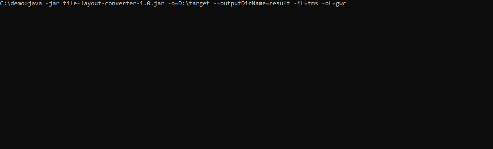

# Tile Layout Converter

Tile Layout Converter is a Java 8 Maven project designed to convert map tiles stored in layouts such as TMS, GWC, XYZ into other layout formats. The project generates a JAR file, which can be executed using the `java -jar` command with various arguments.

This project arose from the need to convert map data in the TMS layout, generated with the geodetic profile argument using the gdal2tiles library, to the GWC layout for compatibility with GeoServer applications before version 2.17.X. It also originated from the necessity to open a cached map with the GWC layout only in a map application that supports only the TMS layout.

However, the need for this project may no longer exist, as GeoServer versions 2.17.X and later support the TMS layout in their blobstore.

### Demo



Total Number of Files: 13,495

Total File Size: 177 MB

Total Elapsed Time for Conversion: 3.5 seconds

### Usage

#### Command Line Options

- `-i, --input`: Path of the input directory. Default value is the **current user directory**.

- `-o, --output`: Path of the output directory. Default value is the **current user directory**.

- `-n, --outputDirName`: Name of the created main directory. Default value is **converted_result**.

- `-iL, --inputLayout`: Directory layout type of the input data. Default value is **tms**. Possible layout types are TMS, GWC, XYZ.

- `-oL, --outputLayout`: Target directory layout type to be converted. Default value is **gwc**. Possible layout types are TMS, GWC, XYZ.

- `-V, --version`: Prints version information and exit.

- `-h, --help`: Shows help document and exit.

#### Example

```
    java -jar tile-layout-converter-1.0.jar -i /path/to/input -o /path/to/output -n my_output -iL tms -oL gwc
```
This command will convert tiles from the TMS layout in the input directory to the GWC layout in the specified output directory with the name "my_output".

### Building the Project

1. **Clone the tile-layout-converter repository from GitHub:**

    ```
       git clone https://github.com/Aknbb/tile-layout-converter.git
    ```
   
2. **Use Maven to install dependencies and build the project.:**

    ```
        mvn clean install
    ```

    This will generate the **tile-layout-converter-1.0** JAR file in the target directory.

### License

This project is licensed under the [MIT License](LICENSE).

#### Contact
Feel free to explore my Tile Layout Converter project and get in touch if you have any questions or collaboration ideas. You can reach out to me via [akinbuyukbulut@gmail.com](mailto:akinbuyukbulut@gmail.com) or connect with me on [LinkedIn](https://www.linkedin.com/in/akinbuyukbulut/) and [GitHub](https://github.com/Aknbb).